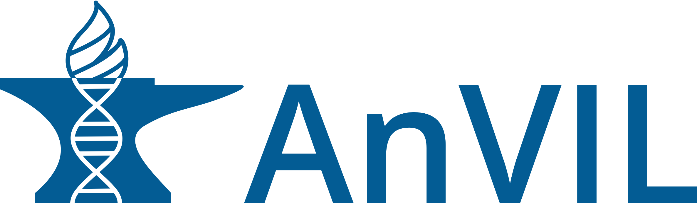

```{r}
library(surveydown)

satisfaction_options <- c(
  'Very dissatisfied' = 1,
  'Dissatisfied' = 2,
  'Neutral' = 3,
  'Satisfied' = 4,
  'Very satisfied' = 5
)

likert_options <- c(
  'Strongly disagree' = 1,
  'Somewhat disagree' = 2,
  'Neither agree nor disagree' = 3,
  'Somewhat agree' = 4,
  'Strongly agree' = 5
)

priority_features <- c(
  'Access to relevant datasets' = 'data_access',
  'Cost' = 'cost',
  'Ease of use / learning curve' = 'usability',
  'Security and compliance (e.g., controlled-access data)' = 'security',
  'Computing power or scalability' = 'compute_power',
  'Availability of pre-built tools or workflows' = 'tools_workflows',
  'Ability to collaborate with others' = 'collaboration',
  'Institutional admin / IT support' = 'institutional',
  'Community or peer support' = 'community'
)

what_would_help <- c(
  'Clearer documentation or tutorials' = 'documentation',
  'A simpler or more intuitive interface' = 'usability',
  'Lower cost / more funding' = 'cost',
  'Institutional admin / IT support' = 'institutional',
  'Access to additional datasets' = 'data_access',
  'Access to additional tools or workflows' = 'tools_workflows',
  'More training or onboarding resources' = 'training',
  'Better integration with other platforms I use' = 'integration',
  "Nothing - I don't need AnVIL right now" = 'no_need',
  'None of these' = "none",
  'Other' = 'other'
)

what_would_help_previous <- append(c('Nothing — AnVIL already meets my needs' = 'all_met'), 
                                  what_would_help, 
                                  after = length(what_would_help) - 2)

priority_options <- c(
    "Not a priority" = 1,
    "Low priority" = 2,
    "Moderate priority" = 3,
    "High priority" = 4,
    "Essential" = 5
  )

yes_no_options <- c(
  'Yes' = 1,
  'No' = 0 
)

yes_no_unsure_options <- c(
  yes_no_options, 
  c(
    'Unsure' = 99
  )
)

```

--- welcome

{fig-alt="AnVIL" width="180" fig-align="center"}

<br>

# State of the AnVIL 2026: Community Poll

Thank you for participating in the State of the AnVIL 2025 Community Poll!

[AnVIL](https://anvilproject.org/) (the NHGRI Genomic Data Science Analysis, Visualization, and Informatics Lab-space) is a unified environment for secure data management and computing. It enables cloud-based analysis of large datasets without the need to move that data.

This poll aims to understand your experience with the AnVIL platform, including your needs and any barriers to adoption, by collecting data on usage, experiences, and preferences. It should take 10–15 minutes to complete.

Your feedback will directly shape how we develop AnVIL to better support your work and research needs.

**DATA CONFIDENTIALITY**: Responses are anonymous. Data will be stored on a private, password-protected server with access restricted to members of the AnVIL Team.

**DATA SHARING**: Insights from this data may be shared externally within summary reports (published with a peer-reviewed journal or posted on a public website) or infographics. All poll responses are aggregated and reported anonymously to protect the privacy of participants. 

**PARTICIPATION**: You must be 18 or over to participate. You can stop participating in the poll at any point. You do not need to answer optional questions. Any answers that are ultimately submitted (and not removed or requested to be removed by the participant) will continue to be used for platform improvement and/or reports.

**RISK**: Risk of participation is minimal. The questions we ask pose minimal security risk to participants as they focus on your personal experience and expectations. While we have taken measures to ensure the security of the poll responses, please be aware that no online system is completely secure. By participating in this poll, you understand and accept the inherent risks associated with transmitting information over the internet. 

**CONSENT**: By completing this poll, you are consenting to be included in our study. Your participation is voluntary and you can stop at any time.

<br>

```{r}

sd_question(
  type   = 'mc',
  id     = 'consent',
  label  = "I am 18 or over AND I consent to my responses being used for evaluation and development of the AnVIL platform.",
  option = yes_no_options
)

sd_nav(page_next = "page2", show_previous = FALSE)
```

--- screenout

## Thank you for your interest!

Unfortunately, you do not meet the eligibility requirements for this poll.

```{r}
sd_close()
```

--- page2

<!-- Demographics -->

```{r}

sd_question(
  type   = 'mc',
  id     = 'role',
  label  = 'What is your career stage/position?',
  option = c(
    'Student (undergraduate, graduate, or medical)' = 'student',
    'Postdoc' = 'postdoc',
    'Academic (professor or principal investigator)' = 'academic',
    'Service (staff scientist, research assistant, bioinformatician, program administrator)' = 'service',
    'Other' = 'other'
  )
)

sd_question(
  type   = 'text',
  id     = 'role_other',
  label  = '(Optional) Please describe your "Other" career stage/position.'
)

sd_question(
  type   = 'mc',
  id     = 'institution_affil',
  label  = 'What type of institution are you affiliated with?',
  option = c(
    'Research Intensive Institution' = 'research',
    'Teaching Focused Institution' = 'teaching',
    'Hospital/Medical Center or School' = 'clinical',
    'Government' = 'gov',
    'Industry' = 'industry',
    'Other' = 'other'
  )
)

sd_question(
  type   = 'text',
  id     = 'institution_affil_other',
  label  = '(Optional) Please describe your "Other" institutional affiliation.'
)

sd_question( #<- tentatively remove
  type = 'matrix',
  id = 'data_categories_experience',
  label = 'How much experience do you have analyzing the following data categories?',
  option = c(
    "No experience" = 1,
    "Little experience" = 2,
    "Some experience" = 3,
    "Moderate experience" = 4,
    "Extensive experience" = 5
  ),
  row = c(
    "Human genomic" = 'human_genomic',
    "Non-human genomic" = "non_human_genomic",
    "Human clinical" = 'human_clinical'
  )
)

sd_question(
  type   = 'mc',
  id     = 'team_member',
  label  = 'Are you currently part of the AnVIL Internal Team?',
  option = yes_no_options #yes skip to page4; no send to next page
)

sd_question(
  type   = 'mc',
  id     = 'user_description',
  label  = 'Which statement best describes your awareness and current usage of the AnVIL Platform?',
  option = c(
    'I currently use AnVIL for my work/research.' = 'aware_current', #send to next page (No skip logic)
    'I have explored or trained on AnVIL, but have not used it for my work/research.' = 'aware_explore', #send to page 3b
    'I have previously used AnVIL for my work/research, but do not currently.' = 'aware_previous', #send to page 3b
    'I have heard of AnVIL, but never used it.' = 'aware_unused', #send to page 3b
    'I have never heard of AnVIL.' = 'unaware' #send to page 3b
  )
)
```

--- page3a

<!-- ## Current / General Users -->

This section asks some general questions about your use of AnVIL.

```{r}

sd_question(
  type   = 'mc_multiple',
  id     = 'why_external',
  label  = 'Do any of the following factor into your use of AnVIL? (select all that apply)',
  option = c(
    'My consortium uses AnVIL' = 'consortium',
    'My institution or funder requires it' = 'required',
    "I use it to comply with NIH's Data security policies" = 'dms',
    'My institution supports or encourages its use' = 'institutional_support',
    'None of these' = 'none'
  )
)

sd_question(
  type   = 'mc_multiple',
  id     = 'why_description',
  label  = 'Why do you choose to use AnVIL? (select all that apply)',
  option = c(
    'To collaborate with others' = 'collab',
    'To make my work more transparent or reproducible' = 'reproducibility',
    'I tried it and it met my needs' = 'tried_liked',
    'It offers features I need (e.g., data access, tools, workflows, computing resources)' = 'specific_feat',
    'Recommended by colleagues' = 'community_rec',
    'It is more affordable than other options' = 'affordability',
    'Other' = 'other'
  )
)

sd_question(
  type   = 'textarea',
  id     = 'why_description_other',
  label  = '(Optional) Please describe your "Other" reason for using AnVIL.'
)

sd_question( ### <-- WHAT DO WE HOPE TO LEARN
  type   = 'mc',
  id     = 'consortia_analysis',
  label  = 'Does your consortium run analyses with AnVIL?',
  option = yes_no_options
)

sd_question( ### <-- WHAT DO WE HOPE TO LEARN
  type   = 'mc',
  id     = 'consortia_data',
  label  = 'Does your consortium use AnVIL to store or release data?',
  option = yes_no_options
)

sd_question( ### <-- WHAT DO WE HOPE TO LEARN
  type  = 'text',
  id    = 'consortia_affil',
  label = '(Optional) Please list your relevant consortia affiliations.'
)

sd_question(
  type   = 'mc',
  id     = 'length_of_use',
  label  = 'How long have you been using AnVIL?',
  option = c(
    '< 1 year' = '0',
    '1-2 years' = '1_2',
    '2-4 years' = '2_4',
    '4-6 years' = '4_6',
    '6+ years' = '6'
  )
)

sd_question(
  type   = 'mc',
  id     = 'nps_score',
  label  = 'On a scale of 0–10, how likely are you to recommend AnVIL to a colleague or collaborator?',
  option = c(
    '0 - Not at all likely' = 0,
    '1' = 1, 
    '2' = 2, 
    '3' = 3, 
    '4' = 4, 
    '5' = 5,
    '6' = 6, 
    '7' = 7, 
    '8' = 8, 
    '9' = 9,
    '10 - Extremely likely' = 10
  )
)

sd_question(
  type  = 'text',
  id    = 'nps_score_explain',
  label = '(Optional) Tell us what factored into your response above.'
)

sd_nav(page_next = 'page4')
```

--- page3b

<!-- ## Previous Users -->

```{r}

sd_question(
  type   = 'mc_multiple',
  id     = 'why_stopped',
  label  = 'Why did you stop using AnVIL? (select all that apply)',
  option = c(
    'My project or role changed' = 'project_change',
    'It no longer met my needs' = 'unmet_needs',
    'I found a different tool or platform that works better for me' = 'switched',
    'Cost' = 'cost',
    'Technical or usability issues' = 'technical',
    'Lack of institutional or funder support' = 'lack_support',
    'Other' = 'other'
  )
)

sd_question(
  type   = 'textarea',
  id     = 'why_stopped_other',
  label  = '(Optional) Please describe the "Other" reason you stopped using AnVIL.'
)

sd_question(
  type   = 'mc_multiple',
  id     = 'what_would_help_previous',
  label  = 'What would make AnVIL easier or more useful for your work? (select all that apply)',
  option = what_would_help_previous
)

sd_question(
  type   = 'textarea',
  id     = 'what_would_help_previous_other',
  label  = '(Optional) Please describe "Other" that would make AnVIL easier or more useful for your work.'
)

sd_question(
  type   = 'matrix',  # or mc_multiple??
  id     = 'platform_priorities_previous',
  label  = 'When choosing a computing platform for your work, how important are the following?',
  row = priority_features,
  option = priority_options
)

sd_nav(page_next = 'page10')
```

--- page3c

<!-- ## Potential Users -->

```{r}

## Might need to be different for never heard of it. Eg, what is important in a computing platform?
sd_question(
  type   = 'mc_multiple',
  id     = 'what_would_help_potential',
  label  = 'What would make AnVIL easier or more useful for your work? (select all that apply)',
  option = what_would_help
)

sd_question(
  type   = 'textarea',
  id     = 'what_would_help_potential_other',
  label  = '(Optional) Please describe "Other" that would make AnVIL easier or more useful for your work.'
)

sd_question(
  type   = 'matrix',  # or mc_multiple??
  id     = 'platform_priorities_potential',
  label  = 'When choosing a computing platform for your work, how important are the following?',
  row = priority_features,
  option = priority_options
)

sd_nav(page_next = 'page10')
```

--- page4

**The next sets of questions ask specifically how you tend to use AnVIL**.

## Specific Use: Data submission

```{r}

sd_question(
  type   = 'mc',
  id     = 'use_submit_data',
  label  = 'Do you submit or manage data (e.g., for a consortium or lab)?',
  option = yes_no_unsure_options
)

sd_question(
  type   = 'mc_multiple',
  id     = 'use_submit_raw_summarized',
  label  = 'Do you submit or manage raw data (e.g., sequencing reads) or summarized data (e.g., count tables, variant calls, etc.)?',
  option = c(
    'Raw data' = 'raw',
    'Summarized data' = 'summarized',
    'Unsure' = 'unsure'
  )
)

sd_question(
  type   = 'mc',
  id     = 'use_submit_satisfaction',
  label  = 'How satisfied are you with AnVIL data submission or management?',
  option = satisfaction_options
)

sd_question( ## Rephrase?
  type   = 'textarea',
  id     = 'what_would_help_submit',
  label  = '(Optional) What would make AnVIL easier or more useful **for your data submission or management work**?'
)

sd_nav(page_next = 'page5')
```

--- page5

## Specific Use: Group support

```{r}

sd_question(
  type   = 'mc',
  id     = 'use_support',
  label  = 'Do you perform group support tasks (e.g., managing or tracking billing)?',
  option = yes_no_options
)

sd_question(
  type = 'mc',
  id   = 'use_support_satisfaction',
  label  = 'How satisfied are you with your support tasks on AnVIL?',
  option = satisfaction_options
)

sd_question( ## Rephrase?
  type   = 'textarea',
  id     = 'what_would_help_use_support',
  label  = '(Optional) What would make **your support tasks on AnVIL** easier or more useful?'
)

sd_nav(page_next = 'page6')
```

--- page6

## Specific Use: Running analyses

```{r}

sd_question(
  type   = 'mc',
  id     = 'use_interactive',
  label  = 'Do you run interactive analyses (e.g., using Galaxy in AnVIL, Jupyter Notebooks, RStudio)?',
  option = yes_no_unsure_options
)

sd_question(
  type   = 'mc_multiple',
  id     = 'which_interactive_use_anvil',
  label  = 'Which interactive analysis solutions do you utilize **on the AnVIL**? (select all that apply)',
  option = c(
    'Jupyter Notebooks / terminal' = 'jupyter_notebooks',
    'RStudio' = 'rstudio',
    'Galaxy in AnVIL' = 'galaxy'
  )
)

sd_question(
  type   = 'textarea',
  id     = 'which_interactive_use_separate',
  label  = '(Optional) Which interactive analysis solutions do you utilize **separate from the AnVIL**?',
)

sd_question(
  type   = 'mc',
  id     = 'use_workflows',
  label  = 'Do you run scalable workflows (e.g., WDL)?',
  option = yes_no_unsure_options
)

sd_question(
  type   = 'mc_multiple',
  id     = 'whose_data_use',
  label  = 'Do you bring your own data to the AnVIL or use AnVIL hosted datasets? (select all that apply)',
  option = c(
    'Bring my own data' = 'own_data',
    'Use AnVIL hosted datasets' = 'anvil_data'
  )
)

sd_question(
  type   = 'mc_multiple',
  id     = 'anvil_data_type',
  label  = 'Do you access raw data (e.g., sequencing reads) or summarized data (e.g., count tables, variant calls, etc.)? (select all that apply)',
  option = c(
    'Raw data' = 'raw',
    'Summarized data' = 'summarized'
  )
)

sd_question(
  type   = 'mc_multiple',
  id     = 'anvil_data_control',
  label  = 'Do you utilize AnVIL hosted open-access or controlled-access datasets? (select all that apply)',
  option = c(
    'AnVIL hosted open-access datasets' = 'open_access',
    'AnVIL hosted controlled-access datasets' = 'controlled_access'
  )
)

sd_question(
  type   = 'mc_multiple',
  id     = 'controlled_datasets_use',
  label  = 'Which of the following large, controlled-access datasets do you use on the AnVIL?',
  option = c(
    'Centers for Common Disease Genomics (CCDG)' = 'ccdg',
    'The Centers for Mendelian Genomics (CMG)' = 'cmg',
    'Clinical Sequencing Evidence-Generating Research (CSER)' = 'cser',
    'Electronic Medical Records and Genomics (eMERGE)' = 'emerge',
    'Gabriella Miller Kids First (GMKF)' = 'gmkf',
    'Genomics Research to Elucidate the Genetics of Rare Diseases (GREGoR)' = 'gregor',
    'The Genotype-Tissue Expression Project (GTEx)' = 'gtex',
    'The Human Pangenome Reference Consortium (HPRC)' = 'hprc',
    'Population Architecture Using Genomics and Epidemiology (PAGE)' = 'page',
    'Undiagnosed Disease Network (UDN)' = 'udn',
    'Other' = 'other'
  )
)

sd_question(
  type  = 'text',
  id    = 'controlled_datasets_use_other',
  label = '(Optional) What "Other" large, controlled-access datasets do you use on the AnVIL?'
)

sd_question(
  type = 'mc',
  id = 'services_use',
  label = 'Do you use data services (e.g., All of Us + AnVIL Imputation)?',
  option = yes_no_options
)

sd_question(
  type = 'mc',
  id   = 'analyses_satisfaction',
  label  = 'How satisfied are you with running analyses on AnVIL?',
  option = satisfaction_options
)

sd_question( ## Rephrase?
  type   = 'textarea',
  id     = 'what_would_help_services',
  label  = '(Optional) What would make AnVIL easier or more useful for **running analyses**?'
)

sd_nav(page_next = 'page7')
```

--- page7

## Specific Use: Group supervision

```{r}

sd_question(
  type   = 'mc',
  id     = 'use_supervise',
  label  = 'Do you supervise (e.g., plan and monitor) the use of the AnVIL platform by others rather than only running analyses or submitting data yourself?',
  option = yes_no_options
)

sd_question(
  type   = 'matrix',
  id     = 'use_supervise_questions',
  label  = 'How much do you agree or disagree with the following statements about AnVIL?',
  row = c(
    'AnVIL helps my team work more efficiently' = 'use_supervise_efficiency',
    'AnVIL helps my team collaborate securely' = 'use_supervise_collab_secure',
    'AnVIL provides resources my team would not otherwise have access to' = 'supervise_provide_resources'
  ),
  option = likert_options
)

sd_question(
  type = 'mc',
  id   = 'use_supervise_satisfaction',
  label  = 'How satisfied are you with supervising others on AnVIL?',
  option = satisfaction_options
)

sd_question( ## Rephrase?
  type   = 'textarea',
  id     = 'what_would_help_supervise',
  label  = '(Optional) What would make AnVIL easier or more useful for **supervising others**?'
)

sd_nav(page_next = 'page8')
```

--- page8

## Specific Use: Educational support

```{r}

sd_question(
  type   = 'mc',
  id     = 'use_ed',
  label  = 'Do you use the AnVIL platform for training or courses that you are leading?',
  option = yes_no_options
)

sd_question(
  type = 'mc',
  id   = 'use_ed_satisfaction',
  label  = 'How satisfied are you with training or leading courses on AnVIL?',
  option = satisfaction_options
)

sd_question( ## Rephrase?
  type   = 'textarea',
  id     = 'what_would_help_ed',
  label  = '(Optional) What would make AnVIL easier or more useful for **training or leading courses**?'
)

sd_nav(page_next = 'page9')

```

--- page9

## Training needs

```{r}

sd_question(
  type   = 'matrix',
  id     = 'training_questions',
  label  = 'How much do you agree or disagree with the following statements about AnVIL?',
  row = c(
    'Formal support (e.g., documentation, training, support forum) is important for my continued and effective use of AnVIL.' = 'training_need',
    'I feel confident knowing where to look to find help for using AnVIL.' = 'location_confidence'
  ),
  option = likert_options
)

sd_question(
  type = 'mc',
  id   = 'training_satisfaction',
  label = 'How satisfied are you with the training that the AnVIL offers?',
  option = satisfaction_options
)

sd_question(
  type = 'textarea',
  id = 'training_satisfaction_barrier',
  label = '(Optional) What AnVIL resources would make your learning easier or more relevant?'
)

sd_question( #<- tentatively remove
  type   = 'mc',
  id     = 'demos',
  label  = 'Have you attended a monthly AnVIL Demo?',
  option = c(
    'Yes, multiple' = 'multiple',
    'Yes, one'      = 'one',
    'Not yet, but am registered to' = 'registered',
    'No, but aware of' = 'aware',
    'No, did not know of' = 'unaware'
  )
)

sd_question( #<- tentatively remove
  type   = 'mc_multiple',
  id     = 'support_forum',
  label  = 'Have you ever read or posted in our AnVIL Support Forum? (select all that apply)',
  option = c(
    "Read through others' posts" = 'read_posts',
    'Posted in' = 'posted',
    "Answered someone's post" = 'answered_post',
    'No, but aware of' = 'aware',
    'No, did not know of' = 'unaware'
  )
)

sd_question(
  type   = 'matrix',
  id     = 'preferred_learning',
  label  = 'Please rank your preferred methods of learning for the AnVIL platform.',
  row    = c(
    'Video tutorials' = 'video',
    'Guided documentation' = 'docs',
    'Live demonstrations' = 'demos',
    'Interactive workshops' = 'workshops',
    'Support forum' = 'forum',
    'Office hours' = 'office_hours',
    'Other' = 'other'
  ),
  option = c(
    'Most preferred' = 1,
    '2' = 2,
    '3' = 3,
    '4' = 4,
    '5' = 5,
    '6' = 6,
    'Least preferred' = 7
  )
)

sd_question(
  type   = 'text',
  id     = 'preferred_learning_other_specify',
  label  = '(Optional) What "Other" methods of learning do you prefer?'
)

sd_question(
    type = 'textarea',
    id   = 'training_wanted',
    label = '(Optional) Please share any additional training resources or topics you would like to see.'
)

sd_nav(page_next = 'page10')

```

--- page10

```{r}

sd_question(
  type = 'textarea',
  id = 'aspirational_roadmap',
  label = '(Optional) Overall, what is the most important thing you think the AnVIL team should focus on?'
)

sd_nav(page_next = 'end')

```

--- end

Thank you for your responses!

```{r}

sd_close()
```
